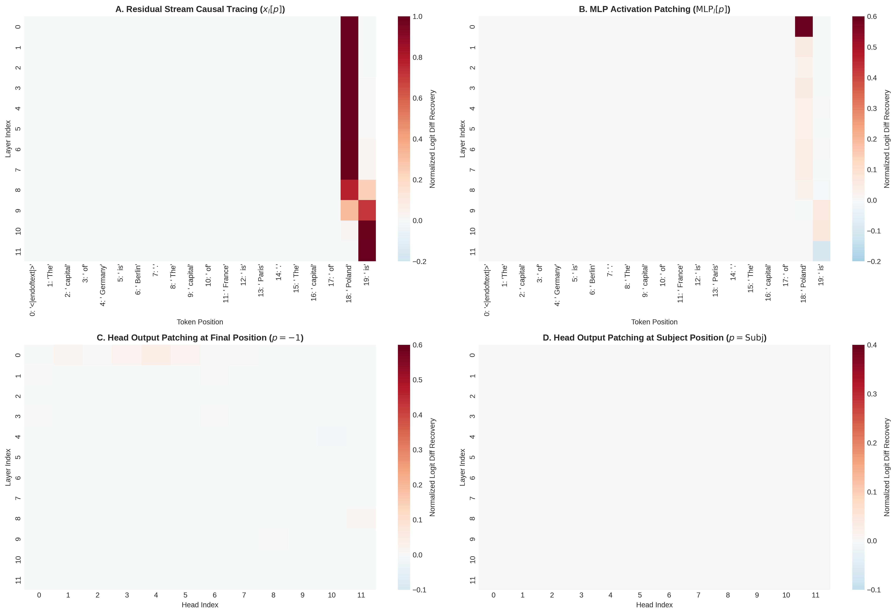
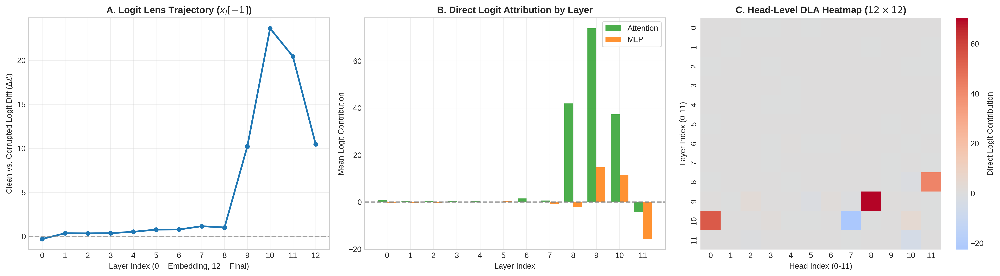
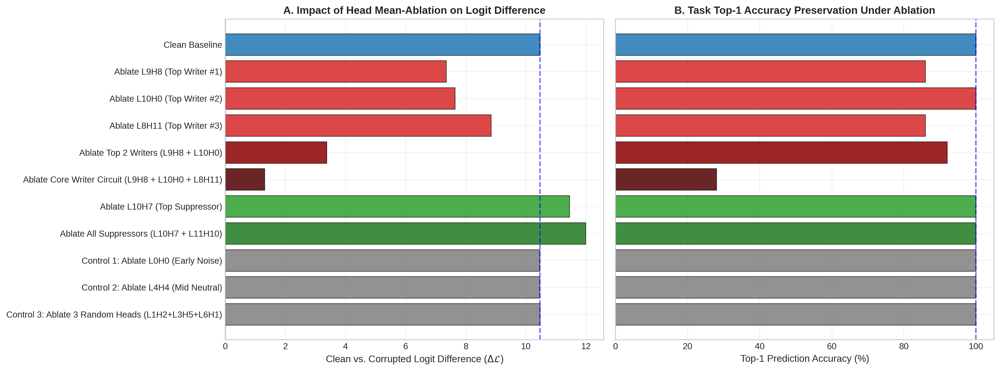

# Causal Tracing and Circuit Discovery in Small Open-Weight Transformers: Isolating Factual Retrieval and Suppression Mechanisms

[](paper/main.pdf)
[](#one-click-reproduction)
[](LICENSE)
[](https://www.python.org/downloads/)

**Author:** Vedansh Kumar (`vedanshk10@gmail.com`)  
**Target Architecture:** `gpt2-small` (124M parameters, 12 layers, 12 heads/layer, $d_{\text{model}} = 768$)

---

## Abstract
Understanding how autoregressive language models store, retrieve, and route factual knowledge remains a central challenge in mechanistic interpretability. In this work, we reverse-engineer the factual association circuit in `gpt2-small` across a structurally balanced, single-token counterfactual dataset. Using Logit Lens and Direct Logit Attribution (DLA), we uncover a pronounced late-layer accumulation dynamic where factual confidence peaks at Layer 10 ($\Delta \mathcal{L} = +23.8$) before being damped at the output stage. 

Through activation patching across 144 attention heads, residual streams, and MLP blocks, we isolate the spatial and temporal mechanics of factual recall: the subject entity is maintained in the residual stream at the subject token position through Layer 7, undergoes causal transfer across Layers 8–9, and is projected into the vocabulary space at the final token position. We identify a sparse writing core consisting of just three attention heads (`L9H8`, `L10H0`, `L8H11`). Joint mean-ablation of this three-head subcircuit causes an **87.46% collapse in logit difference** ($\Delta \mathcal{L} = +10.46 \rightarrow +1.31$) and degrades task accuracy from $100.0\%$ to $28.0\%$, whereas non-circuit control heads exhibit zero degradation. Finally, we discover a dedicated negative damping circuit dominated by head `L10H7`, whose targeted ablation disinhibits model confidence by $+14.56\%$.

---

## Core Empirical Findings

### 1. The Causal Information Transfer Locus
Activation patching across all $(l, p)$ pairs reveals that subject representations remain local to the subject token position through Layer 7 before transferring across Layers 8–9 to the final token position.



### 2. Extreme Writer Sparsity & Logit Lens Dynamics
Direct Logit Attribution indicates that output writing is dominated by three specific attention heads (`L9H8`, `L10H0`, `L8H11`), while Logit Lens reveals an over-accumulation peak at Layer 10.



### 3. Knockout Ablation & Necessity Validation
Mean-ablation confirms that knocking out the 3 core writing heads collapses the model's factual recall capability, whereas knocking out negative suppressor heads (`L10H7`, `L11H10`) disinhibits factual logit difference.

| Experimental Condition | Mean $\Delta \mathcal{L}$ | Logit Drop (%) | Top-1 Accuracy (%) | Heads Ablated |
| :--- | :---: | :---: | :---: | :---: |
| **Clean Baseline** | **10.46** | **0.00%** | **100.0%** | **0** |
| Ablate `L9H8` (Top Writer #1) | 7.35 | 29.74% | 86.0% | 1 |
| Ablate `L10H0` (Top Writer #2) | 7.64 | 26.96% | 100.0% | 1 |
| Ablate `L8H11` (Top Writer #3) | 8.84 | 15.53% | 86.0% | 1 |
| Ablate Top 2 Writers (`L9H8 + L10H0`) | 3.38 | 67.73% | 92.0% | 2 |
| **Ablate Core Writer Circuit (`L9H8 + L10H0 + L8H11`)** | **1.31** | **87.46%** | **28.0%** | **3** |
| Ablate `L10H7` (Top Suppressor) | 11.45 | -9.44% | 100.0% | 1 |
| Ablate All Suppressors (`L10H7 + L11H10`) | 11.98 | -14.56% | 100.0% | 2 |
| Control 1: `L0H0` (Early Noise) | 10.46 | 0.04% | 100.0% | 1 |
| Control 2: `L4H4` (Mid Neutral) | 10.46 | 0.03% | 100.0% | 1 |
| Control 3: Random Triple (`L1H2 + L3H5 + L6H1`) | 10.46 | -0.04% | 100.0% | 3 |



---

## One-Click Reproduction

To run the complete pipeline and regenerate all figures and metrics locally:

```bash
git clone [https://github.com/vex-codes/gpt2-factual-circuit-discovery.git](https://github.com/vex-codes/gpt2-factual-circuit-discovery.git)
cd gpt2-factual-circuit-discovery
pip install -r requirements.txt
python reproduce_all.py
```

---

## Citation

If you build upon this work or utilize the experimental pipeline, please cite:

```bibtex
@article{kumar2026causal,
  title={Causal Tracing and Circuit Discovery in Small Open-Weight Transformers: Isolating Factual Retrieval and Suppression Mechanisms},
  author={Kumar, Vedansh},
  journal={Independent Preprint},
  year={2026}
}
```
